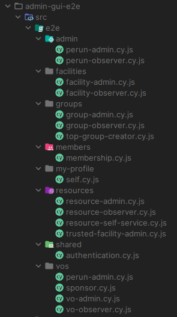
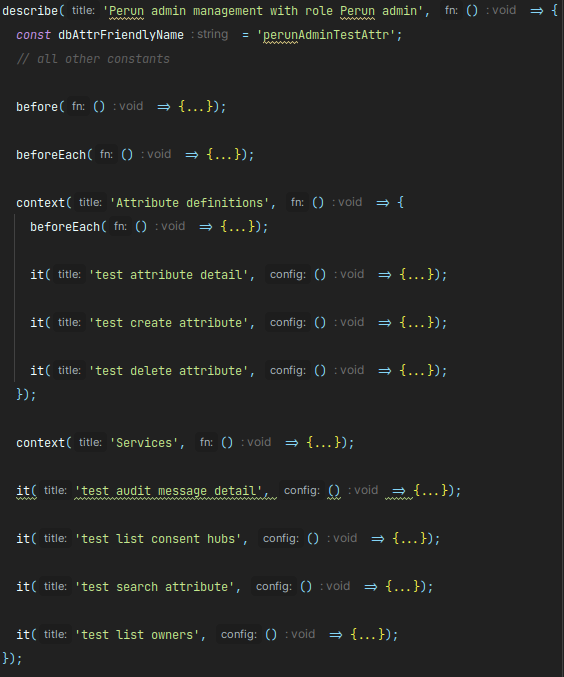

# Contributing to Perun AAI

## Table of Contents

[General guidelines](#general-guidelines)

[Commit Message Guidelines](#commit-message-guidelines)

[End-to-end tests](#end-to-end-tests)

* [Tests execution](#tests-execution)
* [How to run E2E tests locally](#how-to-run-e2e-tests-locally)
  * [Initial (one-time) setup](#initial-one-time-setup)
  * [Repeated steps](#repeated-steps)
* [Developing E2E tests](#developing-e2e-tests)
  * [Folder structure](#folder-structure)
  * [Test file structure](#test-file-structure)
  * [Cypress custom commands](#cypress-custom-commands)
  * [Catch errors in the console](#catch-errors-in-the-console)
  * [Test data](#test-data)
  * [Debugging](#debugging)

## General guidelines

See general guidelines for [contributing to Perun AAI](https://gitlab.ics.muni.cz/perun/common/-/blob/main/CONTRIBUTING.md).

Additional rules are outlined in this document.

## Commit Message Guidelines

Use the name of the app as the scope of the commit message where applicable:

- admin
- profile
- pwdreset
- consolidator
- linker
- publications
- openapi
- lib
- npm

### Breaking Changes

Use `BREAKING CHANGE:`

- for new required configuration
  - new value is required in instanceConfig
  - a property was renamed in instanceConfig
- when functionality is removed
  - e.g. a dialog was removed and some action is no longer possible

## Configuration

Please refer to the main [README](README.md) file.

## End-to-end tests

Our E2E tests are developing in [Cypress](https://www.cypress.io/). Currently, just the admin-gui app is covered by E2E tests. On the other hand (thanks to [Nx](https://nx.dev/) generators and Nx recommendations for mono repo project architecture) we've established folders containing default configurations for E2E tests dedicated to each application (app name with the postfix `-e2e`), so we are ready to start developing E2E tests for all applications. E2E tests for admin-gui can be found [here](https://gitlab.ics.muni.cz/perun/perun-idm/perun-web-apps/-/tree/main/apps/admin-gui-e2e).

Alongside these application-specific folders, we maintain a shared folder [e2e](https://gitlab.ics.muni.cz/perun/perun-idm/perun-web-apps/-/tree/main/e2e?ref_type=heads) which contains testing `instanceConfig.json`, files for the PostgreSQL container, and files for the RPC container. The E2E tests require Apache as well. Prepared image is accessible [here](https://gitlab.ics.muni.cz/perun/ci/pipeline-components/-/tree/main/perun-apache).

Running E2E tests locally requires these three containers. However, for CI execution, we additionally require a Cypress image, which is accessible [here](https://gitlab.ics.muni.cz/perun/ci/pipeline-components/-/tree/main/cypress).

### Tests execution

Our CI environment executes tests based on the rules specified in the [gitlab-ci.yml](https://gitlab.ics.muni.cz/perun/perun-idm/perun-web-apps/-/blob/main/.gitlab-ci.yml) within the block labeled `e2e_tests` - `rules`. Currently, tests run automatically for each merge request merged to the `main` branch. Furthermore, manual test runs are possible for any merge request that modifies files defined in the `admin_gui_e2e_files` variable.

### How to run E2E tests locally

To handle the local execution of E2E tests, there is a `docker-compose.yml` file which sets up a dedicated testing environment for local test execution.

To run E2E tests locally:

#### Initial (one-time) setup

1. Prepare instance config:

    ```sh
    cp e2e/instanceConfig.json apps/admin-gui/src/assets/config/instanceConfig.json
    ```

2. Get a [personal access token](https://gitlab.ics.muni.cz/-/profile/personal_access_tokens) with the scope `read_registry`
3. Log in to GitLab registry:

    ```sh
    sudo docker login registry.gitlab.ics.muni.cz:443
    # enter your username (UČO)
    # paste the personal access token
    ```

#### Repeated steps

4. Start the environment:

    ```sh
    sudo docker compose up -d --build
    sudo docker compose logs -f
    ```

5. Run admin GUI and tests (in a second terminal):

    ```sh
    npm run e2e
    ```

   or (for interactive mode)

    ```sh
    npm run e2e-watch
    ```

6. Stop the environment:

    ```sh
    sudo docker compose down
    ```

It is also important to keep track of the desired RPC version. The RPC version is specified in the `e2e/docker-postresql/Dockerfile` file.

### Developing E2E tests

Tests are located within the `apps/admin-gui-e2e/src/e2e` folder. Each test should be fully independent. For instance, creating an entity in one test and attempting to delete the same entity in another should be avoided. Ideally, entities intended for deletion should be prepared at the database level beforehand (for more information see [Test data](#test-data)).

Authentication is provided via BasicAuth. Credentials for test users are stored in the `apps/admin-gui-e2e/cypress.config.json`. This file can also store other Cypress [configuration options](https://docs.cypress.io/guides/references/configuration).

HTML elements are identified using the `data-cy` attribute following the best practice outlined in the Cypress documentation. Here is an example:

```sh
# How to use 'data-cy' in the HTML 
data-cy="create-vo-button" 
attr.data-cy="{{group.name}}-checkbox" 
attr.data-cy="{{attribute.displayName | multiWordDataCy}}-value"
```

While the static HTML can be identified using the basic `data-cy` attribute, dynamically generated HTML (e.g., table rows with data from BE) requires `attr.data-cy`. For multi-word identifiers (e.g., unique attribute names in a table), a custom pipe `multiWordDataCy` transforms them into lowercase, one-word identifiers joined with a hyphen.

#### Folder structure

Tests are categorized into subfolders according to the GUI logical sections (e.g. `vos`, `groups`, `facilities`). Each folder can contain multiple test files related to various user roles. The names of these files correspond to the respective roles and are executed accordingly with the correct credentials. However, the `shared` folder diverges from this pattern as it is dedicated to shared logic (e.g. authentication, logging-out, footer, etc.) rather than role-based separation.



In the future, scenarios might require testing specific role combinations (e.g. `assignGroupToResource` - `RESOURCESELFSERVICE` + `GROUPADMIN`). Then we have two options. If there are more test cases for the given combination of roles, we will create a separate file for this purpose. On the other hand, if there are very few test cases for the given combination, a more general file `role-combination.cy.js` will be created within the corresponding section folder (e.g. for `assignGroupToResource` it will be within `/resource` folder). In this file also other role combinations with a few test cases can be placed. Each combination will be grouped within a Cypress context. Proper authentication for these combinations will be managed inside the 'before()' section of this context (see Cypress context below).

#### Test file structure

Currently, all tests within a file are grouped into a single `describe` block with several `context` blocks inside it. In the future, additional `describe` blocks might be introduced if necessary. However, the current structure allows all tests to share basic logic in `before/beforeEach` blocks, while the internal structure is managed by contexts. Each `context` can also have its `before/beforeEach`, executed after the `before/beforeEach` from the `describe` block. Contexts primarily serve to group tests related to the same logic.



#### Cypress custom commands

We use Cypress custom commands to minimize code redundancy and enhance test readability. This feature allows us to define some action in one place and use it across all the tests. All you need to do to create a new custom command is to define the logic in the [commands.ts](https://gitlab.ics.muni.cz/perun/perun-idm/perun-web-apps/-/blob/main/apps/admin-gui-e2e/src/support/commands.ts) file and declare this command in the [index.d.ts](https://gitlab.ics.muni.cz/perun/perun-idm/perun-web-apps/-/blob/main/apps/admin-gui-e2e/src/index.d.ts). Once completed, your command becomes universally accessible across all tests. Our login custom command can serve as an inspiration for implementation.

#### Catch errors in the console

We aim not to test every individual use case during E2E testing. However, an error might occur on the currently tested page, but the test could be written in a manner that it will pass successfully. To efficiently improve our basic test coverage, we utilize `cypress-fail-on-console-error`. This library allows us to ensure that every page accessed during testing has been completed without any errors appearing in the console.

#### Test data

All SQL queries to set up test data and test environment are located in the `e2e/docker-postresql/3-init.sql` file. If creating a new test that requires initial data, the necessary data should be prepared here. Running `docker compose up` with correct SQL queries will display the message `database system is ready to accept connections` in the logs.

When creating a new test user, ensure that credentials are added to the `cypress.config.json` file (mentioned earlier) and the MD5 hash of these credentials is also added to the Apache config file [perun.passwd](https://gitlab.ics.muni.cz/perun/ci/pipeline-components/-/blob/main/perun-apache/perun.passwd).

```sh
# How to create hashed credentials
$ htpasswd -nbm myName myPassword
myName:$apr1$r31.....$HqJZimcKQFAMYayBlzkrA/
```

If the Apache container has already been created, recreate it to apply these changes when executing tests locally. You can test the new credentials [here](http://localhost:8081/ba/rpc/).

#### Debugging

For debugging purposes, you can run commands within a running container. For example, you can check if the container contains all the required configuration files. For that purpose, you can run the command `docker exec -it [name] /bin/bash` (you can find the name of the container via `docker ps`).

You can also run containers one by one e.g. just a database container via `docker compose up -d db`.
